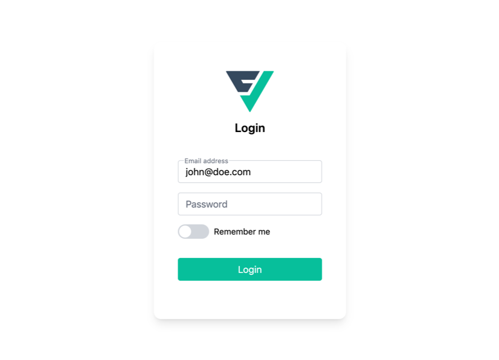

 

# Vueform Laravel + Vue 2 + Tailwind CSS 3 Boilerplate

*Last tested with Laravel 8.75.*

## Installation (free)

1. Clone this repo with: `git clone https://github.com/vueform/laravel-vue2-starter vueform-laravel-vue2-starter`
2. Log in to your account at <a href="https://vueform.com/sign-in" target="_blank">vueform.com/sign-in</a>
3. Go to **Projects** > **+ New project**
4. Create a new project and copy your **API Key** to `vueform.config.js`
5. Go to project folder `cd vueform-laravel-vue2-starter`
6. Run `composer install` to install Laravel

### npm

7. Run `npm install` to install dependencies
8. Run `npm run dev` to compile assets
9. Run `php artisan serve` to start the server

### yarn

7. Run `yarn install` to install dependencies
8. Run `yarn run dev` to compile assets
9. Run `php artisan serve` to start the server

## Installation (with license)

1. Clone this repo with: `git clone https://github.com/vueform/laravel-vue2-starter vueform-laravel-vue2-starter`
2. Log in to your account at <a href="https://vueform.com/sign-in" target="_blank">vueform.com/sign-in</a>
3. Go to **Projects** > **+ New project**
4. Add `localhost` and live domains to **Project domains** and create the project
5. Download the latest `vueform-x.x.x-hash.zip` file and unzip it
6. Move the **contents** of the unzipped folder to this projects's `./packages/vueform` folder (`./packages/vueform/index.js` must exist)
7. Change `"@vueform/vueform": "^1.2.6"` to `"@vueform/vueform": "file:./packages/vueform"` in `package.json`
8. Go to project folder `cd vueform-laravel-vue2-starter`
9. Run `composer install` to install Laravel

### npm

10. Run `npm install` to install dependencies
11. Run `npm run dev` to compile assets
12. Run `php artisan serve` to start the server

### yarn

10. Run `yarn install` to install dependencies
11. Run `yarn run dev` to compile assets
12. Run `php artisan serve` to start the server

## Demo

Go to `http://localhost:8000` and you should see the following screen:

---

## About Vueform

 
 

Vueform is the industry leading form builder for Vue.js that makes form development a breeze. It standardizes and handles the entire form building process, including:
- a complete theming and templating system with **Tailwind support**
- 25+ form elements with **multi-file uploads**, date pickers and rich text editor
- element **nesting** and **repeating**
- **50+ validators** with async, dependent and custom rules
- **conditional logic** on element & form level
- breaking forms into **steps** with **form wizard**
- **dynamic** form rendering with **JSON** support
- **translating** form content and global i18n support.

Vueform [pre-release](https://vueform.com) is open for registration for the **first 100 developers** with **special discounts**. Learn more: [https://vueform.com](https://vueform.com)
